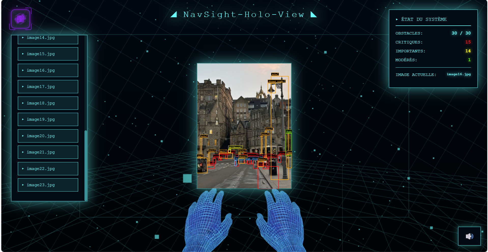

# NavSight (Computer Vision)



School computer vision project for obstacle detection, with a Flask backend and a holographic-style web interface.

It combines:
- **YOLOv8** for object detection
- **Mask2Former (Mapillary Vistas)** for semantic segmentation
- A **Flask API** to run detection and serve data
- A custom **web viewer** for visualization

## Personal note

I made this project for school and decided to publish it so other students can reuse ideas from it.

You will notice many labels/messages are in **French** (my first language). Feel free to translate everything into your own language and rename labels as you prefer.

You can also change the background sound. I used a **Silksong** track in this version simply because I like it.

I also added the 3D hands to create a first-person feeling, meant to represent the visually impaired user's point of view.

## Main features

- Load local images from a dataset folder
- Detect obstacles with a combined YOLO + Mapillary pipeline
- Merge detections and prioritize them by risk level
- Save annotated images
- Export detection metadata to JSON
- Display everything in a custom UI

## How it works (quick flow)

1. You choose an image from the interface.
2. The frontend calls the Flask endpoint `POST /api/detect/<filename>`.
3. The backend runs YOLO + Mask2Former, then merges detections.
4. The backend saves:
	 - an annotated image in `output/annotated_images/`
	 - a JSON report in `output/json/`
5. The UI displays the annotated result and statistics.

## Project structure (important folders)

- `detection_obstacle/`
	- Main application folder.
	- Contains `app.py`, detection logic, frontend files, 3D models, and generated output.

- `detection_obstacle/output/`
	- Stores generated files after each detection.
	- `annotated_images/`: output images with bounding boxes and labels.
	- `json/`: structured metadata (classes, priorities, confidence, bbox).

- `detection_obstacle/assets/`
	- Frontend static files.
	- `css/`: viewer styles.
	- `js/`: viewer logic and API calls.

- `detection_obstacle/3Dmodels/`
	- 3D assets used by the interface.

- `detection_obstacle/audio/`
	- Optional audio files for background sound.
	- You can replace the default track with your own.

- `ressources/images/`
	- Input images used for testing.

- `ressources/models/`
	- Local model storage/cache (YOLO weights + Hugging Face cache).
	- Ignored by git because files are large.

## Requirements

- Python 3.10+ (3.11 recommended)
- Internet on first run if models are not already cached

Dependencies are listed in `requirements.txt`.

## Quick start (Windows / PowerShell)

From the project root:

```bash
py -3.11 -m venv .venv
Set-ExecutionPolicy -Scope Process -ExecutionPolicy Bypass
.\.venv\Scripts\Activate.ps1
pip install --upgrade pip
pip install -r requirements.txt
cd detection_obstacle
python app.py
```

Then open:

`http://127.0.0.1:5000`

## API endpoints

- `GET /api/images` → list available images
- `POST /api/detect/<filename>` → run detection on one image
- `GET /output/<path>` → serve generated output files

## Customization notes

- **Language/UI text**: most text is in French, easy to adapt in HTML/JS.
- **Audio**: replace the file in `detection_obstacle/audio/` and update the `<audio>` source if needed.
- **Obstacle labels/priorities**: editable in `detector_module.py`.

## Known limitations

- Detection can be slow on CPU (Mask2Former is heavy).
- Segmentation confidence is currently fixed in code.
- No voice guidance yet.

## Future improvements

- Add a voice guidance mode that enumerates obstacles and gives direction hints (left / center / right).
- Add multilingual labels directly in the UI.
- Improve accessibility and keyboard navigation in the frontend.

## License

MIT License

Copyright (c) 2026 Ndeye Oumy Sy Diallo (OumyCraft)
